# 业务流程

## 🔄 整体业务流程

### 系统启动流程
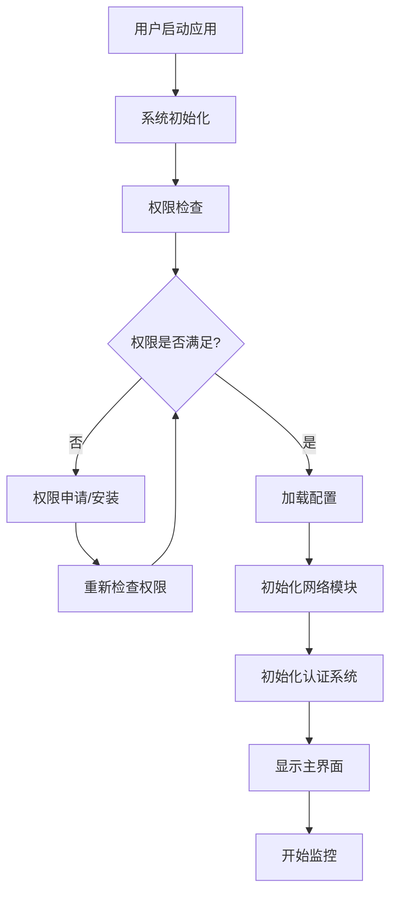
```mermaid
graph TD
    A[用户启动应用] --> B[系统初始化]
    B --> C[权限检查]
    C --> D{权限是否满足?}
    D -->|是| E[加载配置]
    D -->|否| F[权限申请/安装]
    F --> G[重新检查权限]
    G --> D
    E --> H[初始化网络模块]
    H --> I[初始化认证系统]
    I --> J[显示主界面]
    J --> K[开始监控]
```

### 数据流向架构
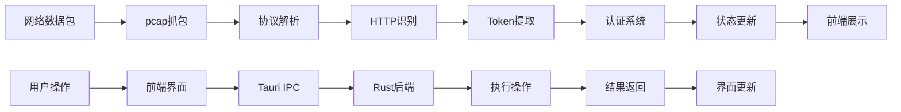
```mermaid
graph LR
    A[网络数据包] --> B[pcap抓包]
    B --> C[协议解析]
    C --> D[HTTP识别]
    D --> E[Token提取]
    E --> F[认证系统]
    F --> G[状态更新]
    G --> H[前端展示]
    
    I[用户操作] --> J[前端界面]
    J --> K[Tauri IPC]
    K --> L[Rust后端]
    L --> M[执行操作]
    M --> N[结果返回]
    N --> O[界面更新]
```

## 🌐 网络抓包业务流程

### 1. 设备检测流程
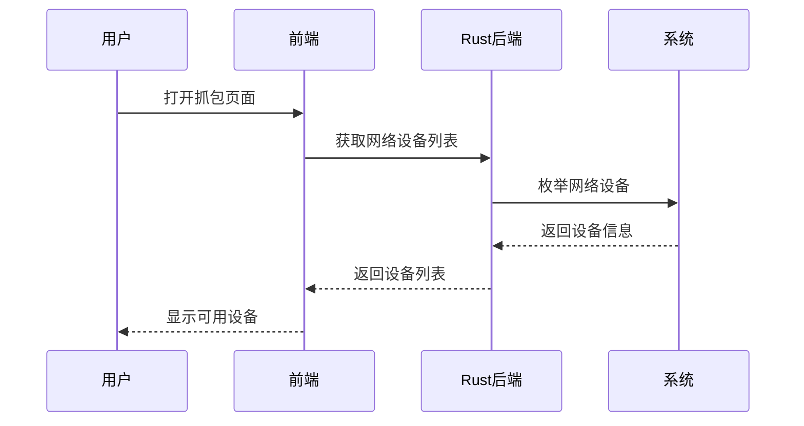
```mermaid
sequenceDiagram
    participant U as 用户
    participant F as 前端
    participant R as Rust后端
    participant S as 系统
    
    U->>F: 打开抓包页面
    F->>R: 获取网络设备列表
    R->>S: 枚举网络设备
    S-->>R: 返回设备信息
    R-->>F: 返回设备列表
    F-->>U: 显示可用设备
```

### 2. 抓包启动流程
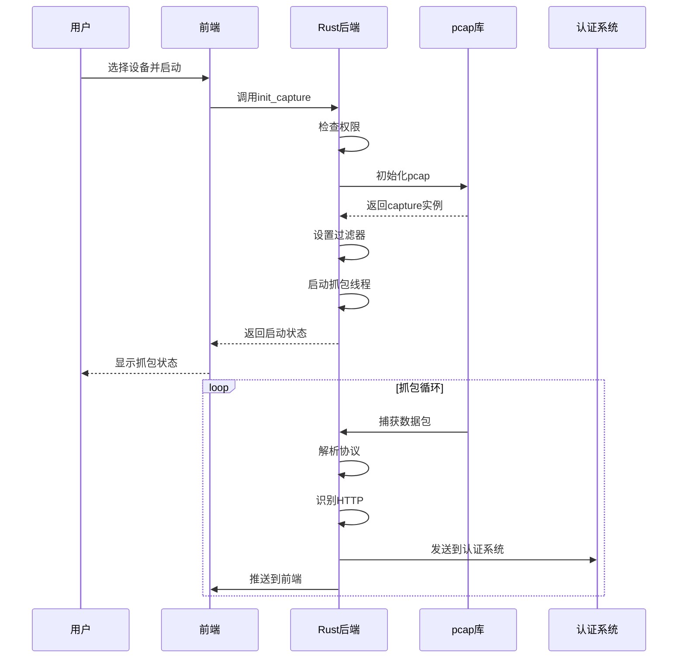
```mermaid
sequenceDiagram
    participant U as 用户
    participant F as 前端
    participant R as Rust后端
    participant P as pcap库
    participant A as 认证系统
    
    U->>F: 选择设备并启动
    F->>R: 调用init_capture
    R->>R: 检查权限
    R->>P: 初始化pcap
    P-->>R: 返回capture实例
    R->>R: 设置过滤器
    R->>R: 启动抓包线程
    R-->>F: 返回启动状态
    F-->>U: 显示抓包状态
    
    loop 抓包循环
        P->>R: 捕获数据包
        R->>R: 解析协议
        R->>R: 识别HTTP
        R->>A: 发送到认证系统
        R->>F: 推送到前端
    end
```

### 3. 数据包处理流程
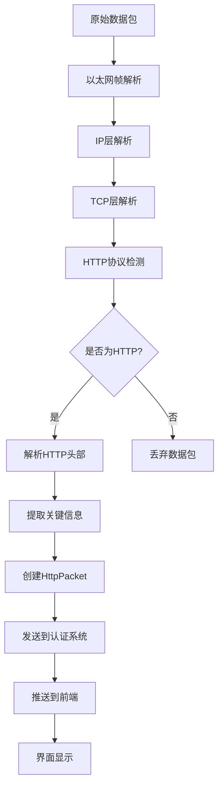
```mermaid
graph TD
    A[原始数据包] --> B[以太网帧解析]
    B --> C[IP层解析]
    C --> D[TCP层解析]
    D --> E[HTTP协议检测]
    E --> F{是否为HTTP?}
    F -->|是| G[解析HTTP头部]
    F -->|否| H[丢弃数据包]
    G --> I[提取关键信息]
    I --> J[创建HttpPacket]
    J --> K[发送到认证系统]
    K --> L[推送到前端]
    L --> M[界面显示]
```

## 🔐 认证管理业务流程

### 1. 认证系统初始化
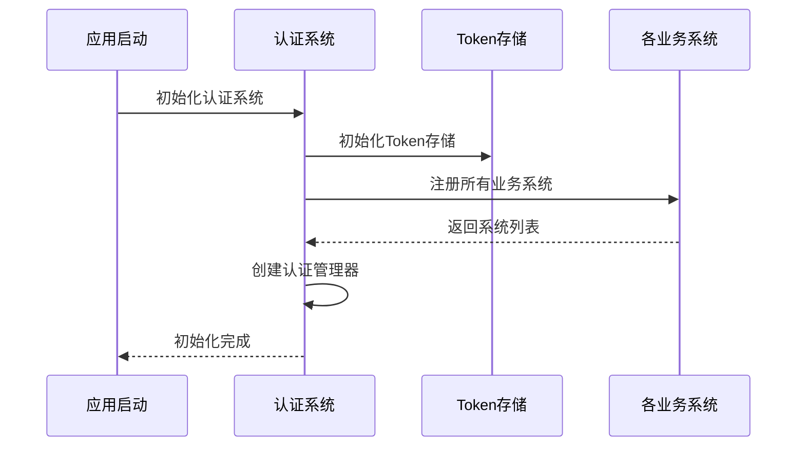
```mermaid
sequenceDiagram
    participant App as 应用启动
    participant Auth as 认证系统
    participant Store as Token存储
    participant Sys as 各业务系统
    
    App->>Auth: 初始化认证系统
    Auth->>Store: 初始化Token存储
    Auth->>Sys: 注册所有业务系统
    Sys-->>Auth: 返回系统列表
    Auth->>Auth: 创建认证管理器
    Auth-->>App: 初始化完成
```

### 2. Token提取流程
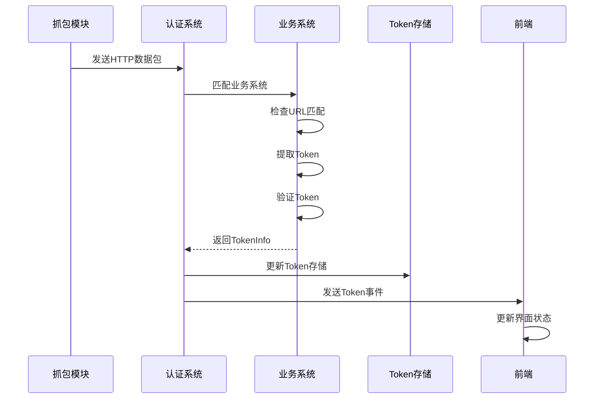
```mermaid
sequenceDiagram
    participant Capture as 抓包模块
    participant Auth as 认证系统
    participant System as 业务系统
    participant Store as Token存储
    participant Frontend as 前端
    
    Capture->>Auth: 发送HTTP数据包
    Auth->>System: 匹配业务系统
    System->>System: 检查URL匹配
    System->>System: 提取Token
    System->>System: 验证Token
    System-->>Auth: 返回TokenInfo
    Auth->>Store: 更新Token存储
    Auth->>Frontend: 发送Token事件
    Frontend->>Frontend: 更新界面状态
```

### 3. 多系统认证流程
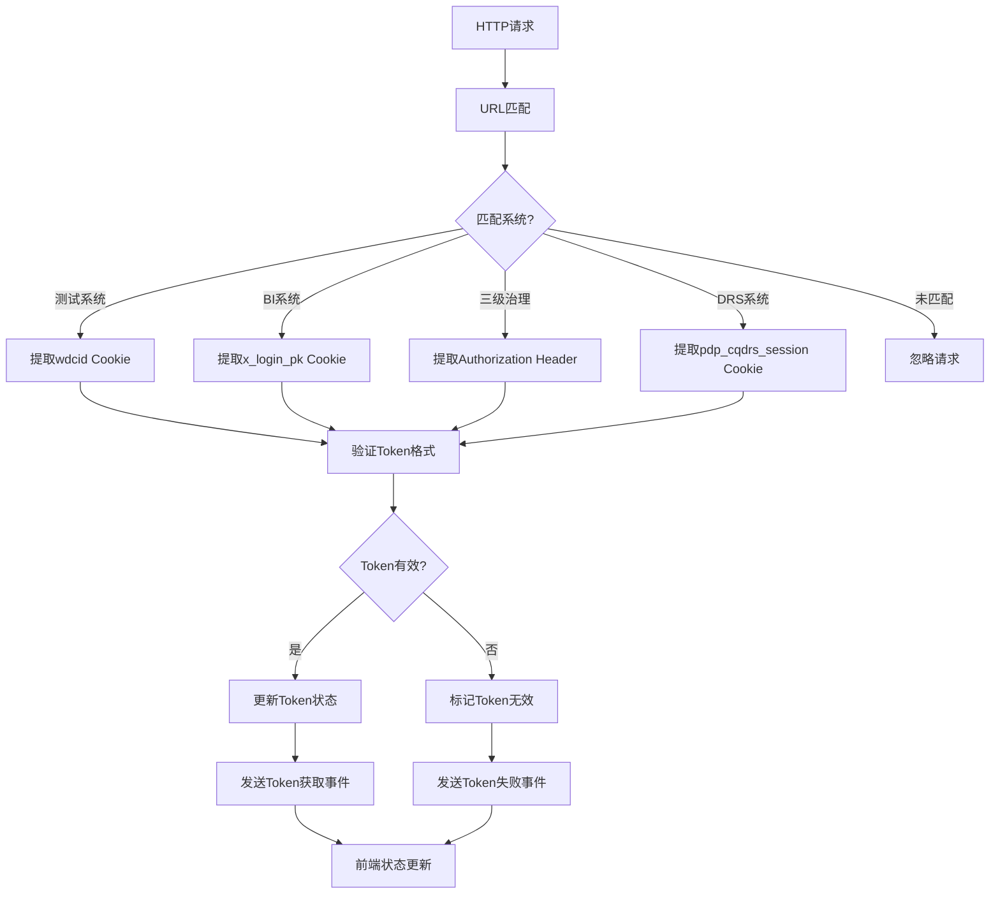
```mermaid
graph TD
    A[HTTP请求] --> B[URL匹配]
    B --> C{匹配系统?}
    C -->|测试系统| D[提取wdcid Cookie]
    C -->|BI系统| E[提取x_login_pk Cookie]
    C -->|三级治理| F[提取Authorization Header]
    C -->|DRS系统| G[提取pdp_cqdrs_session Cookie]
    C -->|未匹配| H[忽略请求]
    
    D --> I[验证Token格式]
    E --> I
    F --> I
    G --> I
    
    I --> J{Token有效?}
    J -->|是| K[更新Token状态]
    J -->|否| L[标记Token无效]
    
    K --> M[发送Token获取事件]
    L --> N[发送Token失败事件]
    
    M --> O[前端状态更新]
    N --> O
```

## 📊 数据巡查业务流程

### 1. 自动化巡查流程
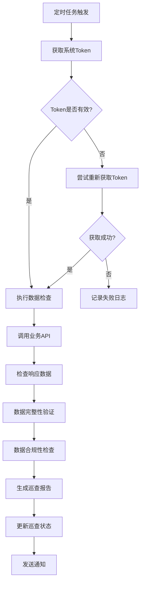
```mermaid
graph TD
    A[定时任务触发] --> B[获取系统Token]
    B --> C{Token是否有效?}
    C -->|是| D[执行数据检查]
    C -->|否| E[尝试重新获取Token]
    E --> F{获取成功?}
    F -->|是| D
    F -->|否| G[记录失败日志]
    
    D --> H[调用业务API]
    H --> I[检查响应数据]
    I --> J[数据完整性验证]
    J --> K[数据合规性检查]
    K --> L[生成巡查报告]
    L --> M[更新巡查状态]
    M --> N[发送通知]
```

### 2. 数据质量检查流程
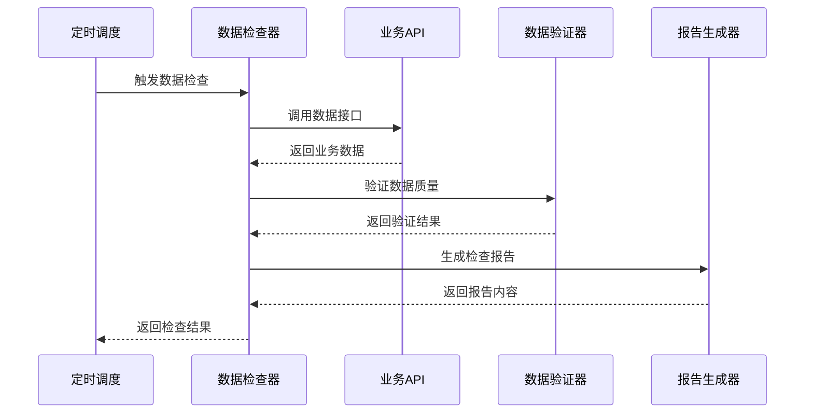
```mermaid
sequenceDiagram
    participant Scheduler as 定时调度
    participant Checker as 数据检查器
    participant API as 业务API
    participant Validator as 数据验证器
    participant Reporter as 报告生成器
    
    Scheduler->>Checker: 触发数据检查
    Checker->>API: 调用数据接口
    API-->>Checker: 返回业务数据
    Checker->>Validator: 验证数据质量
    Validator-->>Checker: 返回验证结果
    Checker->>Reporter: 生成检查报告
    Reporter-->>Checker: 返回报告内容
    Checker-->>Scheduler: 返回检查结果
```

## 🎛️ 权限管理业务流程

### 1. 权限检查流程
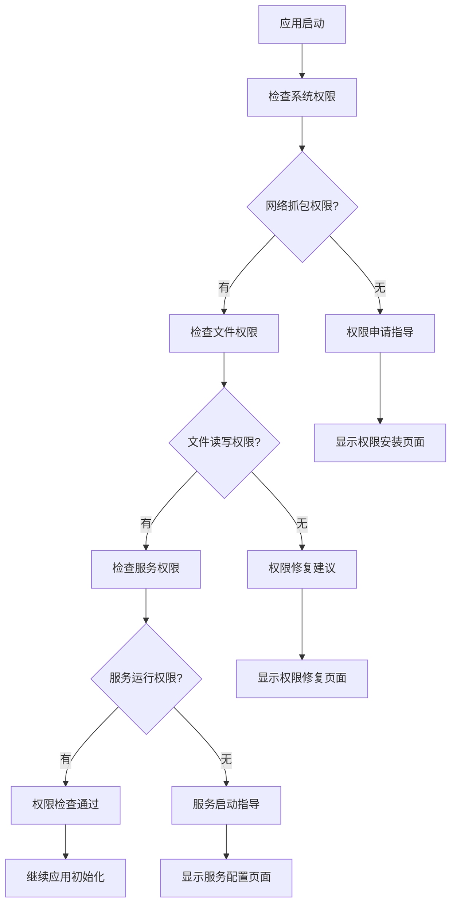
```mermaid
graph TD
    A[应用启动] --> B[检查系统权限]
    B --> C{网络抓包权限?}
    C -->|有| D[检查文件权限]
    C -->|无| E[权限申请指导]
    
    D --> F{文件读写权限?}
    F -->|有| G[检查服务权限]
    F -->|无| H[权限修复建议]
    
    G --> I{服务运行权限?}
    I -->|有| J[权限检查通过]
    I -->|无| K[服务启动指导]
    
    E --> L[显示权限安装页面]
    H --> M[显示权限修复页面]
    K --> N[显示服务配置页面]
    
    J --> O[继续应用初始化]
```

### 2. 权限修复流程
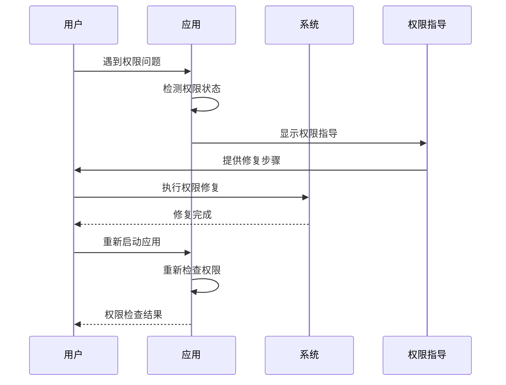
```mermaid
sequenceDiagram
    participant U as 用户
    participant App as 应用
    participant System as 系统
    participant Guide as 权限指导
    
    U->>App: 遇到权限问题
    App->>App: 检测权限状态
    App->>Guide: 显示权限指导
    Guide->>U: 提供修复步骤
    U->>System: 执行权限修复
    System-->>U: 修复完成
    U->>App: 重新启动应用
    App->>App: 重新检查权限
    App-->>U: 权限检查结果
```

## 📋 日志管理业务流程

### 1. 日志记录流程
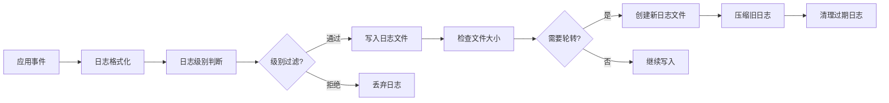
```mermaid
graph LR
    A[应用事件] --> B[日志格式化]
    B --> C[日志级别判断]
    C --> D{级别过滤?}
    D -->|通过| E[写入日志文件]
    D -->|拒绝| F[丢弃日志]
    
    E --> G[检查文件大小]
    G --> H{需要轮转?}
    H -->|是| I[创建新日志文件]
    H -->|否| J[继续写入]
    
    I --> K[压缩旧日志]
    K --> L[清理过期日志]
```

### 2. 日志查看流程
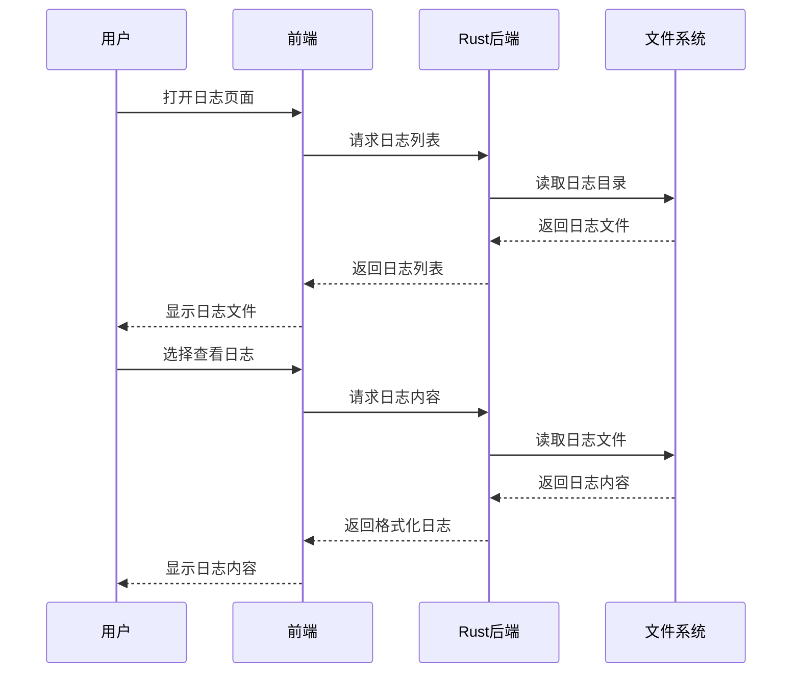
```mermaid
sequenceDiagram
    participant U as 用户
    participant F as 前端
    participant R as Rust后端
    participant FS as 文件系统
    
    U->>F: 打开日志页面
    F->>R: 请求日志列表
    R->>FS: 读取日志目录
    FS-->>R: 返回日志文件
    R-->>F: 返回日志列表
    F-->>U: 显示日志文件
    
    U->>F: 选择查看日志
    F->>R: 请求日志内容
    R->>FS: 读取日志文件
    FS-->>R: 返回日志内容
    R-->>F: 返回格式化日志
    F-->>U: 显示日志内容
```

## 🔄 实时数据同步流程

### 1. Channel通信流程
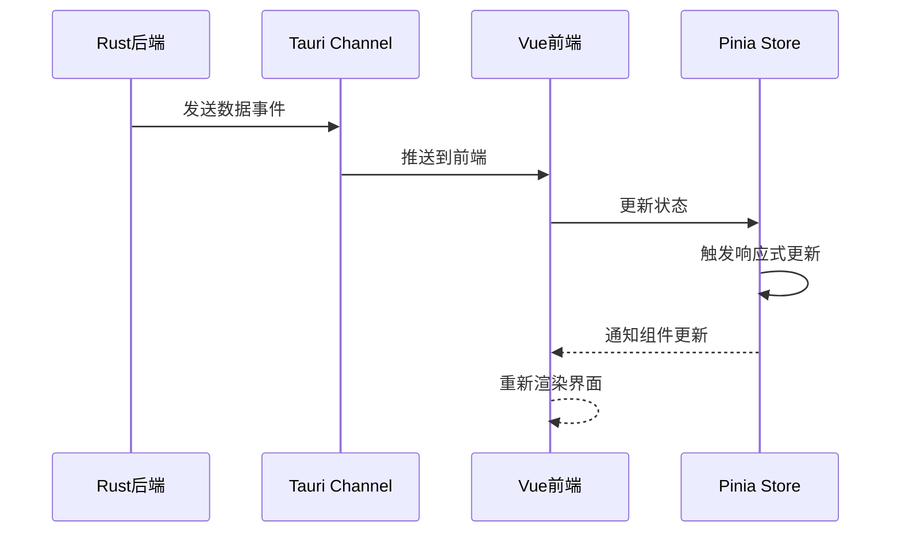
```mermaid
sequenceDiagram
    participant Backend as Rust后端
    participant Channel as Tauri Channel
    participant Frontend as Vue前端
    participant Store as Pinia Store
    
    Backend->>Channel: 发送数据事件
    Channel->>Frontend: 推送到前端
    Frontend->>Store: 更新状态
    Store->>Store: 触发响应式更新
    Store-->>Frontend: 通知组件更新
    Frontend-->>Frontend: 重新渲染界面
```

### 2. 状态同步流程
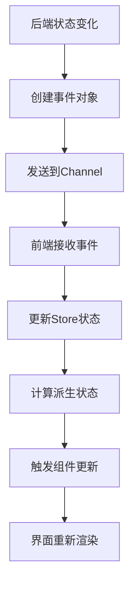
```mermaid
graph TD
    A[后端状态变化] --> B[创建事件对象]
    B --> C[发送到Channel]
    C --> D[前端接收事件]
    D --> E[更新Store状态]
    E --> F[计算派生状态]
    F --> G[触发组件更新]
    G --> H[界面重新渲染]
```

## 🚀 系统启动完整流程

### 详细启动序列
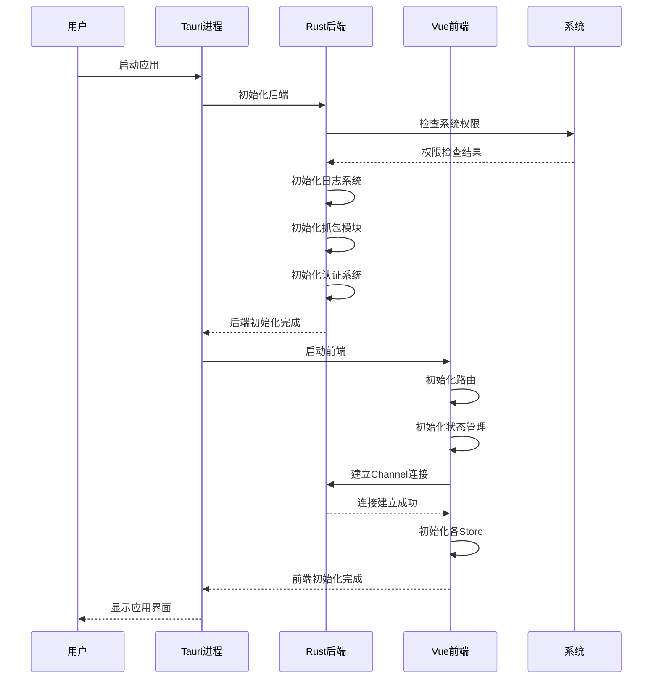
```mermaid
sequenceDiagram
    participant User as 用户
    participant Tauri as Tauri进程
    participant Rust as Rust后端
    participant Vue as Vue前端
    participant System as 系统
    
    User->>Tauri: 启动应用
    Tauri->>Rust: 初始化后端
    Rust->>System: 检查系统权限
    System-->>Rust: 权限检查结果
    Rust->>Rust: 初始化日志系统
    Rust->>Rust: 初始化抓包模块
    Rust->>Rust: 初始化认证系统
    Rust-->>Tauri: 后端初始化完成
    
    Tauri->>Vue: 启动前端
    Vue->>Vue: 初始化路由
    Vue->>Vue: 初始化状态管理
    Vue->>Rust: 建立Channel连接
    Rust-->>Vue: 连接建立成功
    Vue->>Vue: 初始化各Store
    Vue-->>Tauri: 前端初始化完成
    
    Tauri-->>User: 显示应用界面
```

## 🔍 错误处理流程

### 1. 错误捕获和处理
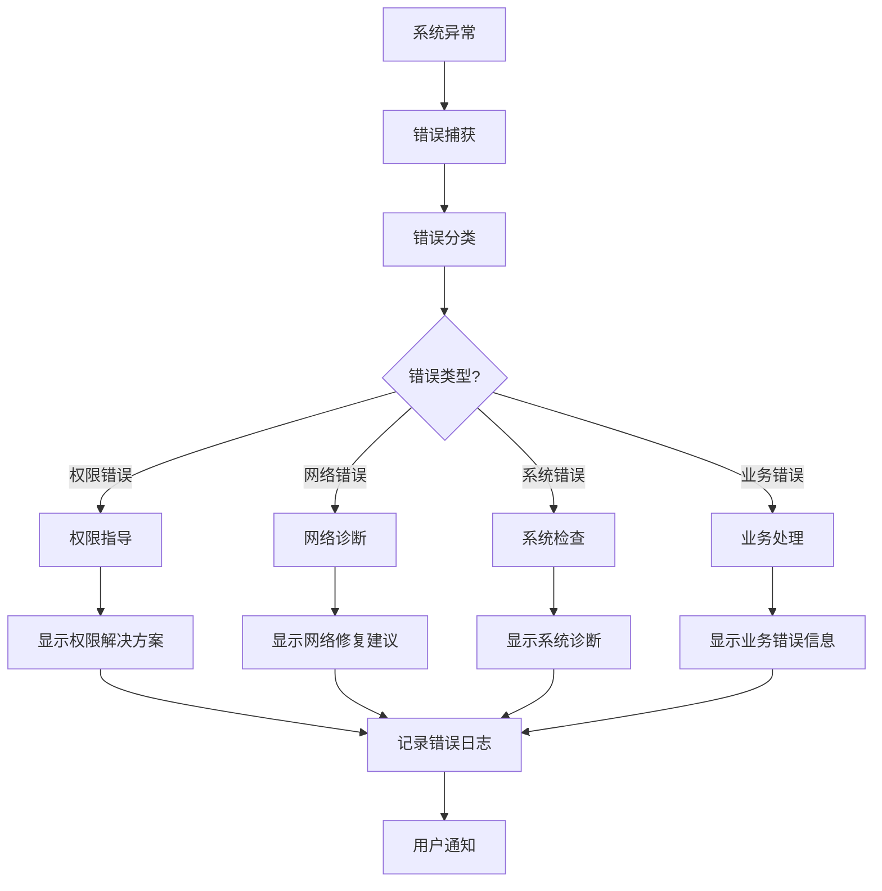
```mermaid
graph TD
    A[系统异常] --> B[错误捕获]
    B --> C[错误分类]
    C --> D{错误类型?}
    D -->|权限错误| E[权限指导]
    D -->|网络错误| F[网络诊断]
    D -->|系统错误| G[系统检查]
    D -->|业务错误| H[业务处理]
    
    E --> I[显示权限解决方案]
    F --> J[显示网络修复建议]
    G --> K[显示系统诊断]
    H --> L[显示业务错误信息]
    
    I --> M[记录错误日志]
    J --> M
    K --> M
    L --> M
    
    M --> N[用户通知]
```

### 2. 错误恢复流程
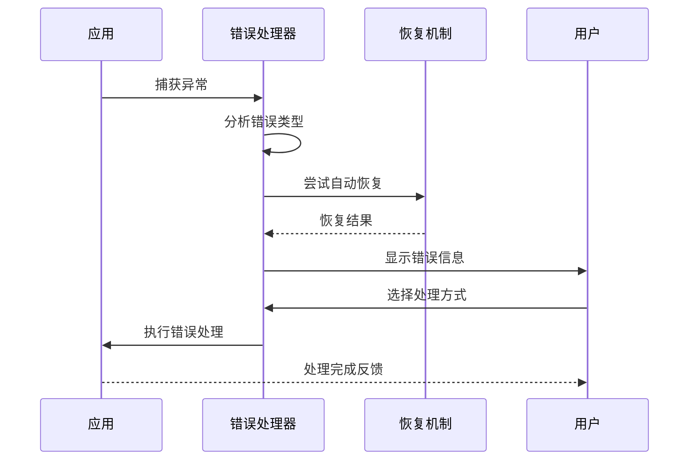
```mermaid
sequenceDiagram
    participant App as 应用
    participant Error as 错误处理器
    participant Recovery as 恢复机制
    participant User as 用户
    
    App->>Error: 捕获异常
    Error->>Error: 分析错误类型
    Error->>Recovery: 尝试自动恢复
    Recovery-->>Error: 恢复结果
    Error->>User: 显示错误信息
    User->>Error: 选择处理方式
    Error->>App: 执行错误处理
    App-->>User: 处理完成反馈
```

这个业务流程文档详细描述了系统各个模块的工作流程和数据流向，为开发者和运维人员提供了清晰的业务逻辑参考。