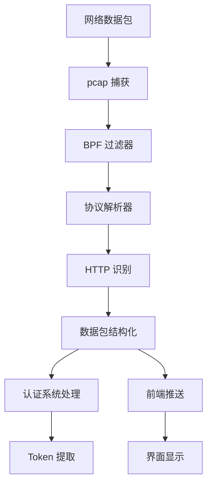

# 网络抓包模块

## 📖 模块概述

网络抓包模块是系统的核心功能之一，负责实时监控和分析网络流量，特别是HTTP/HTTPS协议的数据包。该模块基于高性能的Rust pcap库实现，提供了跨平台的网络数据包捕获和解析能力。

## 🏗️ 架构设计

### 核心组件架构
```
网络抓包模块
├── 网络设备管理
│   ├── 设备检测
│   ├── 设备选择
│   └── 权限验证
├── 数据包捕获
│   ├── pcap 引擎
│   ├── 过滤器设置
│   └── 缓冲区管理
├── 协议解析
│   ├── 以太网解析
│   ├── IP 层解析
│   ├── TCP 层解析
│   └── HTTP 解析
└── 数据流处理
    ├── 实时推送
    ├── 认证集成
    └── 前端通信
```

### 数据流向图

