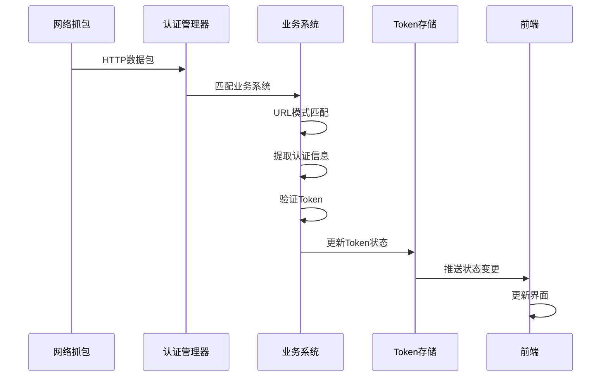

# 认证管理模块

## 📖 模块概述

认证管理模块是系统的核心业务模块，负责自动化管理多个业务系统的Token认证状态。该模块通过监听网络流量，智能识别和提取各种认证信息，并提供统一的认证状态管理和监控能力。

## 🏗️ 架构设计

### 核心组件架构
```
认证管理模块
├── 认证管理器 (AuthManager)
│   ├── 系统注册中心
│   ├── Token存储管理
│   └── 事件分发器
├── 业务系统实现
│   ├── 测试系统 (SystemTest)
│   ├── BI系统 (SystemBI)
│   ├── 三级治理中心 (SystemThree)
│   └── DRS系统 (SystemDRS)
├── Token验证器
│   ├── Cookie验证器
│   ├── Header验证器
│   └── 自定义验证器
└── 前端通信
    ├── 状态同步
    ├── 事件推送
    └── 命令处理
```

### 认证流程图

